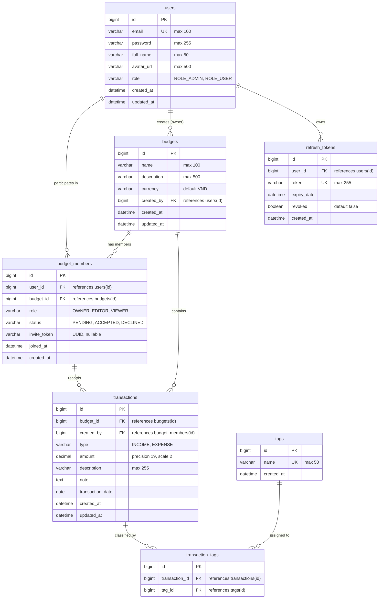

# BudgetShare — Shared Budget & Expense Management System

> A collaborative group budgeting and expense tracking backend system built with **Spring Boot 3** and **Java 21**, featuring advanced JPA optimization, atomic transactional boundaries, and fine-grained Resource-Based Authorization.

---

## 📖 Table of Contents

- [Overview](#-overview)
- [Core Business Domain & Key Workflows](#-core-business-domain--key-workflows)
  - [1. Shared Budget Lifecycle](#1-shared-budget-lifecycle)
  - [2. Member Invitation & Roles](#2-member-invitation--roles)
  - [3. Transaction & Tag Categorization](#3-transaction--tag-categorization)
  - [4. Financial Aggregation & Statistics](#4-financial-aggregation--statistics)
- [Database Design & ERD](#-database-design--erd)
  - [Entity Relationship Diagram](#entity-relationship-diagram)
  - [Data Model Highlights](#data-model-highlights)
- [Technology Stack](#-technology-stack)
- [Project Architecture & Package Structure](#-project-architecture--package-structure)
- [Getting Started](#-getting-started)
  - [Prerequisites](#prerequisites)
  - [Database Configuration](#database-configuration)
  - [Build & Run](#build--run)
- [API Documentation & Quick Test Samples](#-api-documentation--quick-test-samples)
- [Roadmap & Implementation Phases](#-roadmap--implementation-phases)

---

## 🌟 Overview

**BudgetShare** is designed to solve the common challenge of tracking shared living expenses among groups—such as families, housemates, travel companions, or project teams. 

Unlike traditional banking applications with rigid global permissions, BudgetShare focuses on **Resource-Based Authorization**:
* A user's privileges are not globally static; they depend strictly on their role inside each specific `Budget` (`OWNER`, `EDITOR`, or `VIEWER`).
* Many-to-many relationships (User ⬌ Budget, Transaction ⬌ Tag) are modeled via dedicated intermediate entities containing real business logic, audit timestamps, and integrity constraints.

---

## 💼 Core Business Domain & Key Workflows

### 1. Shared Budget Lifecycle
* **Atomic Budget Creation**: When a user creates a new budget, the system executes an atomic transaction that registers the `Budget` and immediately provisions an associated `BudgetMember` record with the `OWNER` role. If any step fails, the entire transaction rolls back.
* **Owner Protection Rules**: 
  * The `OWNER` cannot be deleted or downgraded by other members.
  * The `OWNER` cannot leave the budget without first transferring ownership to another member.
* **Cascade Cleanup**: Deleting a budget cleanly cascades to remove associated memberships, transactions, and tag assignments.

### 2. Member Invitation & Roles
* **Invitation via One-Time Token (`inviteToken`)**:
  * The budget owner sends an invitation to an email address with an assigned role (`EDITOR` or `VIEWER`).
  * The system generates a cryptographic-random UUID `inviteToken` with status `PENDING`.
  * The invited user verifies and accepts (`ACCEPTED`) or declines (`DECLINED`) the invite using the token.
  * Once processed, the `inviteToken` is cleared (`null`), preventing replay attacks.
* **Role Hierarchy**:
  * **`OWNER`**: Full administrative rights (update budget, invite/remove members, manage roles, full transaction CRUD).
  * **`EDITOR`**: Can record, update, and manage transactions within the budget.
  * **`VIEWER`**: Read-only access to transaction history, summaries, and dashboard reports.

### 3. Transaction & Tag Categorization
* **Income & Expense Tracking**: Supports categorized incoming funds (`INCOME`) and expenses (`EXPENSE`) with date, description, note, and amount.
* **Multi-Tag Categorization**: Each transaction can be tagged with multiple categories (e.g., *Groceries*, *Rent*, *Entertainment*) via the `TransactionTag` intermediate relation.
* **Integrity Guarantee**: When creating/updating transactions with tags, all tag relationships are validated and persisted atomically.

### 4. Financial Aggregation & Statistics
* **Type Summary**: Aggregates total income and total expense per budget for dashboard visualization.
* **Member Breakdown**: Groups expenses by individual members to track who spent how much, facilitating fair settlement among members.

---

## 🗄 Database Design & ERD

### Entity Relationship Diagram



### Data Model Highlights
* **Composite Unique Constraints**:
  * `uk_budget_member (user_id, budget_id)`: Prevents duplicate membership records for the same user in a single budget.
  * `uk_transaction_tag (transaction_id, tag_id)`: Prevents assigning the same tag multiple times to one transaction.
* **Indexing Strategy**: Indexes on high-frequency lookup fields (`users.email`, `budget_members.status`, `transactions.transaction_date`, `transactions.type`, `refresh_tokens.token`).
* **Optimized Lazy Loading**: Relationships use `FetchType.LAZY` by default to avoid accidental cartesian products.

---

## 🛠 Technology Stack

| Layer / Concern | Technology / Approach |
|---|---|
| **Core Framework** | **Java 21**, **Spring Boot 3.x** |
| **Persistence** | **Spring Data JPA**, **Hibernate ORM 7.x**, **MySQL 8.0** |
| **JPA Optimization** | `@EntityGraph`, `JOIN FETCH`, `batch_fetch_size=10` (fixes N+1 query problem) |
| **Object Mapping** | **MapStruct 1.6.3** with `lombok-mapstruct-binding` (compile-time code generation) |
| **Validation** | **Jakarta Bean Validation** (`@NotBlank`, `@Size`, `@NotNull`, `@Positive`) |
| **Response Architecture** | Standardized wrappers: `ApiResponse<T>` & `PageResponse<T>` |
| **API Versioning** | URI-based Versioning (`/api/v1/...`) |
| **Build & Tooling** | **Maven Wrapper** (`mvnw`), **Lombok** |

---

## 📁 Project Architecture & Package Structure

The project follows a clean layered monolithic pattern:

```
src/main/java/com/nhat/SharedBudgetManagement/
├── common/             # Global response wrappers (ApiResponse, PageResponse)
├── controller/
│   └── v1/             # RESTful Controllers with URI versioning (/api/v1)
│       ├── BudgetController.java
│       ├── TransactionController.java
│       ├── TagController.java
│       └── UserController.java
├── dto/
│   ├── request/        # Validated input contracts (CreateBudgetRequest, etc.)
│   └── response/       # Data transfer responses with sensitive fields excluded
├── entity/
│   ├── enums/          # BudgetRole, MemberStatus, TransactionType, UserRole
│   ├── Budget.java
│   ├── BudgetMember.java
│   ├── RefreshToken.java
│   ├── Tag.java
│   ├── Transaction.java
│   ├── TransactionTag.java
│   └── User.java
├── mapper/             # MapStruct interfaces (UserMapper, BudgetMapper, etc.)
├── repository/         # Spring Data JPA Repositories with custom queries & @EntityGraph
└── service/
    ├── impl/           # Transactional business service implementations
    ├── BudgetMemberService.java
    ├── BudgetService.java
    ├── TagService.java
    ├── TransactionService.java
    └── UserService.java
```

---

## 🚀 Getting Started

### Prerequisites
* **Java Development Kit (JDK)**: Version 21 or higher
* **Database**: MySQL 8.0+
* **Build Tool**: Apache Maven (included via `./mvnw`)

### Database Configuration
1. Create the MySQL database:
   ```sql
   CREATE DATABASE SharedBudgetManagement CHARACTER SET utf8mb4 COLLATE utf8mb4_unicode_ci;
   ```
2. Adjust your connection credentials in `src/main/resources/application.properties`:
   ```properties
   spring.datasource.url=jdbc:mysql://localhost:3306/SharedBudgetManagement
   spring.datasource.username=root
   spring.datasource.password=your_password
   ```

### Build & Run
1. **Compile and verify mapping**:
   ```bash
   # On Windows
   .\mvnw.cmd clean compile

   # On Linux/macOS
   ./mvnw clean compile
   ```
2. **Run tests**:
   ```bash
   .\mvnw.cmd test
   ```
3. **Start the application**:
   ```bash
   .\mvnw.cmd spring-boot:run
   ```
   The application will start on **`http://localhost:8080`**.

---

## 📡 End-to-End API Testing Guide with Postman / cURL

> 💡 **End-to-End Testing Workflow**:
> The workflow below is sequentially organized according to the actual user journey in the application:
> **1. Register** ➔ **2. Login (Local Login or Google OAuth2 Social Login to obtain JWT)** ➔ **3. Create Budget** ➔ **4. Create Tags & Record 3 Transactions** ➔ **5. Get Paginated & Sorted Transactions** ➔ **6. Refresh Token (Token Rotation)** ➔ **7. Get Financial Summary & Filter Expenses (Paginated & Sorted)** ➔ **8. Logout & Revoke Token**.

---

### ⚙️ Postman Environment Setup
To streamline running requests sequentially without manual copying, create an Environment in Postman with the following variables:
* `baseUrl`: `http://localhost:8080`
* `accessToken`: *(Automatically updated after Login / Token Refresh)*
* `refreshToken`: *(Automatically updated after Login / Token Refresh)*
* `budgetId`: `1`

---

### 🟢 Step 1: Register a New User
Registers a local user account with a BCrypt-hashed password.

* **Method**: `POST`
* **URL**: `{{baseUrl}}/api/v1/auth/register`
* **Headers**: `Content-Type: application/json`
* **Body (JSON)**:
```json
{
  "fullName": "Nguyen Nhat",
  "email": "nhat@example.com",
  "password": "Password123@"
}
```

* **cURL**:
```bash
curl -X POST "http://localhost:8080/api/v1/auth/register" \
  -H "Content-Type: application/json" \
  -d '{"fullName":"Nguyen Nhat","email":"nhat@example.com","password":"Password123@"}'
```

* **Sample Response (201 Created)**:
```json
{
  "status": 201,
  "message": "User registered successfully",
  "data": {
    "id": 1,
    "email": "nhat@example.com",
    "fullName": "Nguyen Nhat",
    "avatarUrl": null,
    "role": "ROLE_USER",
    "authProvider": "LOCAL"
  },
  "timestamp": "2026-09-15T22:15:00"
}
```

---

### 🟢 Step 2: Authenticate & Obtain Tokens (Login)
You can choose **either of the two authentication methods** below to obtain a secure token pair: **Access Token** (expires in 15 minutes) and **Refresh Token** (expires in 7 days):

#### Option 2A: Email & Password (Local Login)
* **Method**: `POST`
* **URL**: `{{baseUrl}}/api/v1/auth/login`
* **Headers**: `Content-Type: application/json`
* **Body (JSON)**:
```json
{
  "email": "nhat@example.com",
  "password": "Password123@"
}
```

* **cURL**:
```bash
curl -X POST "http://localhost:8080/api/v1/auth/login" \
  -H "Content-Type: application/json" \
  -d '{"email":"nhat@example.com","password":"Password123@"}'
```

* **Sample Response (200 OK)**:
```json
{
  "status": 200,
  "message": "Login successful",
  "data": {
    "accessToken": "eyJhbGciOiJIUzI1NiJ9.eyJzdWIiOiIxIiwiZW1haWwiOiJuaGF0QGV4YW1wbGUuY29tIiwicm9sZSI6IlJPTEVfVVNFUiIsImlhdCI6MTc4OTU0NzIwMCwiZXhwIjoxNzg5NTQ4MTAwfQ...",
    "refreshToken": "4a73e6cf-3dc4-4d89-a9eb-83d3e64f8910",
    "tokenType": "Bearer",
    "expiresIn": 900
  },
  "timestamp": "2026-09-15T22:15:05"
}
```

> 💡 **Postman Tip**: Add this snippet to the **Tests** tab of this request to automatically set the environment variables:
> ```javascript
> var jsonData = pm.response.json();
> pm.environment.set("accessToken", jsonData.data.accessToken);
> pm.environment.set("refreshToken", jsonData.data.refreshToken);
> ```

#### Option 2B: Google Social Login (OAuth2 / OpenID Connect)
For passwordless social authentication via Google's Authorization Code Flow:

1. **Initiate Login (Browser)**: Navigate in your browser to:
   ```text
   http://localhost:8080/oauth2/authorization/google
   ```
2. **Grant Consent (Google Consent Screen)**: Sign in with your Google account and approve permissions (email and profile).
3. **Backend Processing**:
   - Google redirects back to `http://localhost:8080/login/oauth2/code/google?code=...`
   - `CustomOAuth2UserService` maps the profile, provisions a new user or links an existing account (`authProvider = GOOGLE`).
   - `OAuth2AuthenticationSuccessHandler` issues system JWT `accessToken` and `refreshToken`, then redirects the browser to the frontend callback URL:
     ```text
     http://localhost:3000/oauth2/callback?token=eyJhbGciOi...&refreshToken=9f82d1ab...
     ```
4. **Use Tokens in Postman**: Copy `token` and `refreshToken` from the browser address bar into Postman's `{{accessToken}}` and `{{refreshToken}}` environment variables to proceed seamlessly!

---

### 🟢 Step 3: Create a Shared Budget
Creates a new budget. The authenticated user is atomically assigned the **OWNER** role in `budget_members`. From this step onward, all requests require the `Authorization: Bearer {{accessToken}}` header.

* **Method**: `POST`
* **URL**: `{{baseUrl}}/api/v1/budgets`
* **Headers**:
  * `Content-Type: application/json`
  * `Authorization: Bearer {{accessToken}}`
* **Body (JSON)**:
```json
{
  "name": "Family Budget 2026",
  "description": "Monthly household living expenses",
  "currency": "VND"
}
```

* **cURL**:
```bash
curl -X POST "http://localhost:8080/api/v1/budgets" \
  -H "Content-Type: application/json" \
  -H "Authorization: Bearer <ACCESS_TOKEN>" \
  -d '{"name":"Family Budget 2026","description":"Monthly household living expenses","currency":"VND"}'
```

* **Sample Response (201 Created)**:
```json
{
  "status": 201,
  "message": "Budget created successfully",
  "data": {
    "id": 1,
    "name": "Family Budget 2026",
    "description": "Monthly household living expenses",
    "currency": "VND",
    "createdAt": "2026-09-15T22:15:10"
  },
  "timestamp": "2026-09-15T22:15:10"
}
```
*(Sets `budgetId = 1` for subsequent steps)*.

---

### 🟢 Step 4: Create Category Tags & Record 3 Transactions

#### 4.1. Create 2 Sample Tags
* **Tag 1 (Food & Dining)**:
  * `POST {{baseUrl}}/api/v1/tags`
  * Headers: `Authorization: Bearer {{accessToken}}`
  * Body: `{"name": "Food & Dining"}` ➔ Result: `id = 1`.
* **Tag 2 (Rent & Utilities)**:
  * `POST {{baseUrl}}/api/v1/tags`
  * Headers: `Authorization: Bearer {{accessToken}}`
  * Body: `{"name": "Rent & Utilities"}` ➔ Result: `id = 2`.

#### 4.2. Transaction 1: Record INCOME (Monthly Salary)
* **Method**: `POST`
* **URL**: `{{baseUrl}}/api/v1/budgets/1/transactions`
* **Headers**: `Authorization: Bearer {{accessToken}}`
* **Body (JSON)**:
```json
{
  "type": "INCOME",
  "amount": 25000000,
  "description": "September 2026 Salary",
  "note": "Company direct bank transfer",
  "transactionDate": "2026-09-10",
  "tagIds": []
}
```

#### 4.3. Transaction 2: Record EXPENSE (Groceries - Associated with Tag 1)
* **Method**: `POST`
* **URL**: `{{baseUrl}}/api/v1/budgets/1/transactions`
* **Headers**: `Authorization: Bearer {{accessToken}}`
* **Body (JSON)**:
```json
{
  "type": "EXPENSE",
  "amount": 1250000,
  "description": "Supermarket grocery shopping",
  "note": "Fresh meat, vegetables, and fruit for the week",
  "transactionDate": "2026-09-12",
  "tagIds": [1]
}
```

#### 4.4. Transaction 3: Record EXPENSE (Utilities - Associated with Tag 2)
* **Method**: `POST`
* **URL**: `{{baseUrl}}/api/v1/budgets/1/transactions`
* **Headers**: `Authorization: Bearer {{accessToken}}`
* **Body (JSON)**:
```json
{
  "type": "EXPENSE",
  "amount": 1800000,
  "description": "Electricity & Water Bill",
  "note": "September utility bill payment",
  "transactionDate": "2026-09-14",
  "tagIds": [2]
}
```

* **Sample Response (201 Created)**:
```json
{
  "status": 201,
  "message": "Transaction created successfully",
  "data": {
    "id": 3,
    "type": "EXPENSE",
    "amount": 1800000,
    "description": "Electricity & Water Bill",
    "note": "September utility bill payment",
    "transactionDate": "2026-09-14",
    "createdBy": {
      "id": 1,
      "fullName": "Nguyen Nhat",
      "email": "nhat@example.com"
    },
    "tags": [
      { "id": 2, "name": "Rent & Utilities" }
    ],
    "createdAt": "2026-09-15T22:15:30"
  },
  "timestamp": "2026-09-15T22:15:30"
}
```

---

### 🟢 Step 5: Get Paginated & Sorted Transactions
Retrieves all transactions belonging to `budgetId = 1`.

> 🔒 **Resource-Based RBAC Enforcement**: Access is granted only if the caller is an active budget member (`OWNER`, `EDITOR`, or `VIEWER`) through `@budgetSecurity.canView(#budgetId)`. User identity is automatically resolved from the JWT `UserPrincipal`—**no `userId` parameter needed**.

* **Method**: `GET`
* **URL**: `{{baseUrl}}/api/v1/budgets/1/transactions?page=0&size=10&sort=transactionDate,desc`
* **Headers**: `Authorization: Bearer {{accessToken}}`

* **cURL**:
```bash
curl -X GET "http://localhost:8080/api/v1/budgets/1/transactions?page=0&size=10&sort=transactionDate,desc" \
  -H "Authorization: Bearer <ACCESS_TOKEN>"
```

* **Sample Response (200 OK with `PageResponse<T>`)**:
```json
{
  "status": 200,
  "message": "Success",
  "data": {
    "content": [
      {
        "id": 3,
        "type": "EXPENSE",
        "amount": 1800000,
        "description": "Electricity & Water Bill",
        "transactionDate": "2026-09-14",
        "tags": [{ "id": 2, "name": "Rent & Utilities" }]
      },
      {
        "id": 2,
        "type": "EXPENSE",
        "amount": 1250000,
        "description": "Supermarket grocery shopping",
        "transactionDate": "2026-09-12",
        "tags": [{ "id": 1, "name": "Food & Dining" }]
      },
      {
        "id": 1,
        "type": "INCOME",
        "amount": 25000000,
        "description": "September 2026 Salary",
        "transactionDate": "2026-09-10",
        "tags": []
      }
    ],
    "page": 0,
    "size": 10,
    "totalElements": 3,
    "totalPages": 1,
    "first": true,
    "last": true,
    "empty": false,
    "sortBy": "transactionDate",
    "sortDirection": "DESC"
  },
  "timestamp": "2026-09-15T22:15:35"
}
```

---

### 🟢 Step 6: Refresh Token (Token Rotation)
When the 15-minute Access Token nears or reaches expiration, the client exchanges the Refresh Token for a fresh token pair without requiring credentials again.

> 🛡️ **Defensive Token Rotation**:
> 1. The previous Refresh Token is immediately revoked (`revoked = true`).
> 2. A brand-new `accessToken` and a fresh `refreshToken` are issued.
> 3. If an attacker attempts to reuse an already-revoked refresh token, the **defensive revocation mechanism** triggers immediately, invalidating all refresh tokens owned by that user and forcing re-authentication.

* **Method**: `POST`
* **URL**: `{{baseUrl}}/api/v1/auth/refresh-token`
* **Headers**: `Content-Type: application/json`
* **Body (JSON)**:
```json
{
  "refreshToken": "{{refreshToken}}"
}
```

* **cURL**:
```bash
curl -X POST "http://localhost:8080/api/v1/auth/refresh-token" \
  -H "Content-Type: application/json" \
  -d '{"refreshToken":"<REFRESH_TOKEN>"}'
```

* **Sample Response (200 OK)**:
```json
{
  "status": 200,
  "message": "Token refreshed successfully",
  "data": {
    "accessToken": "eyJhbGciOiJIUzI1NiJ9.eyJzdWIiOiIxIiwibmV3X2FjY2Vzc190b2tlbiI6dHJ1ZX0...",
    "refreshToken": "9f82d1ab-4c3e-4fa2-9b27-68ef7390a1b2",
    "tokenType": "Bearer",
    "expiresIn": 900
  },
  "timestamp": "2026-09-15T22:15:40"
}
```
*(Remember to update `accessToken` and `refreshToken` with the new values for subsequent requests)*.

---

### 🟢 Step 7: Get Financial Summary & Filter Expenses (Paginated & Sorted)

#### 7.1. Get Financial Summary
Calculates aggregate total income and total expense for the budget dashboard:
* **Method**: `GET`
* **URL**: `{{baseUrl}}/api/v1/budgets/1/transactions/summary`
* **Headers**: `Authorization: Bearer {{accessToken}}`

* **cURL**:
```bash
curl -X GET "http://localhost:8080/api/v1/budgets/1/transactions/summary" \
  -H "Authorization: Bearer <ACCESS_TOKEN>"
```

* **Sample Response (200 OK)**:
```json
{
  "status": 200,
  "message": "Success",
  "data": {
    "EXPENSE": 3050000.00,
    "INCOME": 25000000.00
  },
  "timestamp": "2026-09-15T22:15:45"
}
```

#### 7.2. Filter Expenses with Pagination & Descending Amount Sort
Demonstrates filtering by transaction type combined with pagination and multi-property sorting:
* **Method**: `GET`
* **URL**: `{{baseUrl}}/api/v1/budgets/1/transactions?type=EXPENSE&page=0&size=10&sort=amount,desc`
* **Headers**: `Authorization: Bearer {{accessToken}}`

* **Sample Response (200 OK)**:
```json
{
  "status": 200,
  "message": "Success",
  "data": {
    "content": [
      {
        "id": 3,
        "type": "EXPENSE",
        "amount": 1800000.00,
        "description": "Electricity & Water Bill",
        "transactionDate": "2026-09-14",
        "tags": [{ "id": 2, "name": "Rent & Utilities" }]
      },
      {
        "id": 2,
        "type": "EXPENSE",
        "amount": 1250000.00,
        "description": "Supermarket grocery shopping",
        "transactionDate": "2026-09-12",
        "tags": [{ "id": 1, "name": "Food & Dining" }]
      }
    ],
    "page": 0,
    "size": 10,
    "totalElements": 2,
    "totalPages": 1,
    "first": true,
    "last": true,
    "empty": false,
    "sortBy": "amount",
    "sortDirection": "DESC"
  },
  "timestamp": "2026-09-15T22:15:50"
}
```

---

### 🟢 Step 8: Logout & Revoke Refresh Token
Logs out by revoking the Refresh Token in the database. Once revoked, the token cannot be used to generate new access tokens.

* **Method**: `POST`
* **URL**: `{{baseUrl}}/api/v1/auth/logout`
* **Headers**:
  * `Content-Type: application/json`
  * `Authorization: Bearer {{accessToken}}`
* **Body (JSON)**:
```json
{
  "refreshToken": "{{refreshToken}}"
}
```

* **cURL**:
```bash
curl -X POST "http://localhost:8080/api/v1/auth/logout" \
  -H "Content-Type: application/json" \
  -H "Authorization: Bearer <ACCESS_TOKEN>" \
  -d '{"refreshToken":"<REFRESH_TOKEN>"}'
```

* **Sample Response (200 OK)**:
```json
{
  "status": 200,
  "message": "Logged out successfully",
  "data": null,
  "timestamp": "2026-09-15T22:15:55"
}
```

> 🔒 **Verify Token Invalidation**:
> If you attempt to reuse the revoked `refreshToken` at `POST /api/v1/auth/refresh-token`, the request is blocked with:
> ```json
> {
>   "status": 401,
>   "errorCode": "REFRESH_TOKEN_REVOKED",
>   "message": "Refresh token has been revoked",
>   "timestamp": "2026-09-15T22:16:00"
> }
> ```

---

## 🗺 Roadmap & Implementation Phases

- [x] **Phase 1: Database & Entity Design** — Tables, intermediate entities, relationships, constraints, and enums.
- [x] **Phase 2: Base CRUD & Advanced JPA** — Repositories, pagination/sorting, `@EntityGraph` anti-N+1 loading, atomic service transactions.
- [x] **Phase 3: REST API Layer & DTO Standardization** — MapStruct mappers, `ApiResponse<T>` / `PageResponse<T>`, request validations, versioned controllers.
- [x] **Phase 4: Global Exception Handling** — `@RestControllerAdvice`, `ErrorCode` enum, domain exception hierarchy, and Bean Validation error mapping.
- [x] **Phase 5: Core Security & JWT Authentication** — Spring Security 6, login/register, JWT access/refresh token rotation, Resource-Based Authorization (`OWNER`, `EDITOR`, `VIEWER`).
- [x] **Phase 6: OAuth2 Social Login Integration** — Google OAuth2 Login, OpenID Connect, CustomOAuth2UserService, Account Linking, JWT token issuance pipeline.
- [ ] **Phase 7: Redis Caching & Rate Limiting** — Cache-Aside for tags/summaries, token blacklisting for instant logout, sliding-window rate limiting.
- [ ] **Phase 8: Spring Mail Integration** — Asynchronous email delivery for budget invitations (`inviteToken`) and password reset (TTL via Redis).
- [ ] **Phase 9: Comprehensive Automated Testing (Service Layer)** — Extensive unit and mock tests with JUnit 5 and Mockito covering all business edge cases.
- [ ] **Phase 10: Interactive OpenAPI 3 / Swagger Documentation** — SpringDoc OpenAPI 3 interactive API playground with Bearer JWT Auth support.
- [ ] **Phase 11: Containerization, DevOps & CI/CD Pipelines** — Multi-stage `Dockerfile` (<200MB), `docker-compose.yml` (App + MySQL 8 + Redis), and automated GitHub Actions CI/CD pipelines.
- [ ] **Phase 12: Message Queue & Event-Driven Architecture (RabbitMQ - Optional Extension)** — Decouple heavy background workloads (asynchronous email dispatch, budget overrun alerts) with Dead Letter Queues (DLQ) and exponential retry policies.

---

## 📚 Supplementary Documentation

* **[HUONG_DAN_UNIT_TEST_MOCKITO.md](HUONG_DAN_UNIT_TEST_MOCKITO.md)**: Complete practical handbook on Unit Testing with JUnit 5 & Mockito, containing layer-by-layer templates for all project services, controllers, and security components.
* **[OAUTH2_EXPLANATION.md](OAUTH2_EXPLANATION.md)**: Comprehensive guide on OAuth 2.0, OpenID Connect (OIDC), Spring Security OAuth2 client internals, and the Google Login architectural flow.
* **[KIEM_TRA_GIAI_DOAN_6.md](KIEM_TRA_GIAI_DOAN_6.md)**: Phase 6 verification report, Google Cloud Console credentials setup instructions, and testing scenarios.
* **[SPRING_SECURITY_JWT_CHI_TIET.md](SPRING_SECURITY_JWT_CHI_TIET.md)**: Deep-dive architectural guide on Spring Security 6, Stateless JWT, Token Rotation, Defensive Revocation & Resource-Based Authorization.
* **[HUONG_DAN_REVIEW_CODEBASE.md](HUONG_DAN_REVIEW_CODEBASE.md)**: Comprehensive step-by-step checklist to review the entire 9-layer architectural codebase.
* **[KIEM_TRA_GIAI_DOAN_5.md](KIEM_TRA_GIAI_DOAN_5.md)**: Verification guide, Resource-Based RBAC matrix, and cURL test scenarios for Spring Security 6 & JWT.
* **[KIEM_TRA_GIAI_DOAN_4.md](KIEM_TRA_GIAI_DOAN_4.md)**: Verification guide, Before-vs-After comparison, and cURL test commands for Global Exception Handling.
* **[TONG_KET_CAC_GIAI_DOAN.md](TONG_KET_CAC_GIAI_DOAN.md)**: Detailed phase-by-phase architectural summary, bug fix records, and engineering progression.
* **[BudgetShare-Project.md](BudgetShare-Project.md)**: Original project proposal and requirements specification.