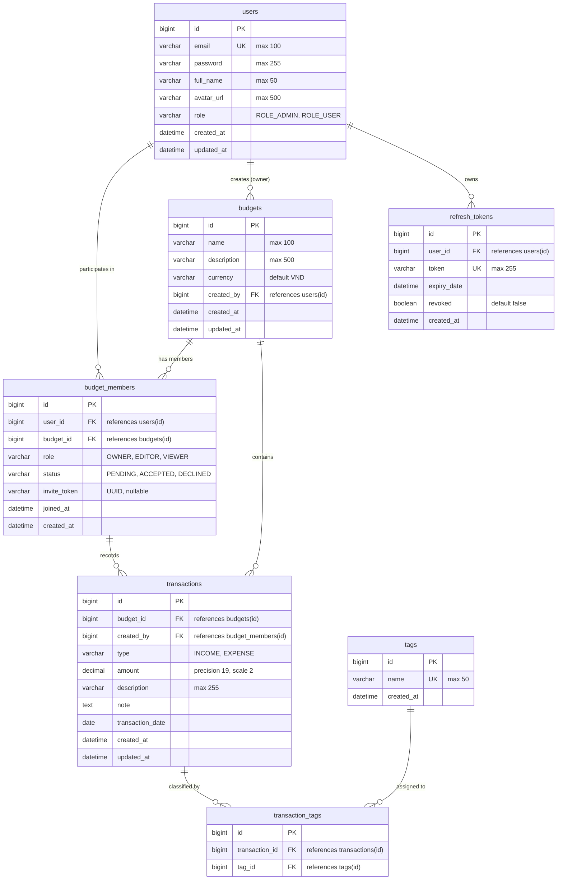

# BudgetShare — Shared Budget & Expense Management System

> A collaborative group budgeting and expense tracking backend system built with **Spring Boot 3** and **Java 21**, featuring advanced JPA optimization, atomic transactional boundaries, and fine-grained Resource-Based Authorization.

---

## 📖 Table of Contents

- [Overview](#-overview)
- [Core Business Domain & Key Workflows](#-core-business-domain--key-workflows)
  - [1. Shared Budget Lifecycle](#1-shared-budget-lifecycle)
  - [2. Member Invitation & Roles](#2-member-invitation--roles)
  - [3. Transaction & Tag Categorization](#3-transaction--tag-categorization)
  - [4. Financial Aggregation & Statistics](#4-financial-aggregation--statistics)
- [Database Design & ERD](#-database-design--erd)
  - [Entity Relationship Diagram](#entity-relationship-diagram)
  - [Data Model Highlights](#data-model-highlights)
- [Technology Stack](#-technology-stack)
- [Project Architecture & Package Structure](#-project-architecture--package-structure)
- [Getting Started](#-getting-started)
  - [Prerequisites](#prerequisites)
  - [Database Configuration](#database-configuration)
  - [Build & Run](#build--run)
- [API Documentation](#-api-documentation)
- [Roadmap & Implementation Phases](#-roadmap--implementation-phases)

---

## 🌟 Overview

**BudgetShare** is designed to solve the common challenge of tracking shared living expenses among groups—such as families, housemates, travel companions, or project teams. 

Unlike traditional banking applications with rigid global permissions, BudgetShare focuses on **Resource-Based Authorization**:
* A user's privileges are not globally static; they depend strictly on their role inside each specific `Budget` (`OWNER`, `EDITOR`, or `VIEWER`).
* Many-to-many relationships (User ⬌ Budget, Transaction ⬌ Tag) are modeled via dedicated intermediate entities containing real business logic, audit timestamps, and integrity constraints.

---

## 💼 Core Business Domain & Key Workflows

### 1. Shared Budget Lifecycle
* **Atomic Budget Creation**: When a user creates a new budget, the system executes an atomic transaction that registers the `Budget` and immediately provisions an associated `BudgetMember` record with the `OWNER` role. If any step fails, the entire transaction rolls back.
* **Owner Protection Rules**: 
  * The `OWNER` cannot be deleted or downgraded by other members.
  * The `OWNER` cannot leave the budget without first transferring ownership to another member.
* **Cascade Cleanup**: Deleting a budget cleanly cascades to remove associated memberships, transactions, and tag assignments.

### 2. Member Invitation & Roles
* **Invitation via One-Time Token (`inviteToken`)**:
  * The budget owner sends an invitation to an email address with an assigned role (`EDITOR` or `VIEWER`).
  * The system generates a cryptographic-random UUID `inviteToken` with status `PENDING`.
  * The invited user verifies and accepts (`ACCEPTED`) or declines (`DECLINED`) the invite using the token.
  * Once processed, the `inviteToken` is cleared (`null`), preventing replay attacks.
* **Role Hierarchy**:
  * **`OWNER`**: Full administrative rights (update budget, invite/remove members, manage roles, full transaction CRUD).
  * **`EDITOR`**: Can record, update, and manage transactions within the budget.
  * **`VIEWER`**: Read-only access to transaction history, summaries, and dashboard reports.

### 3. Transaction & Tag Categorization
* **Income & Expense Tracking**: Supports categorized incoming funds (`INCOME`) and expenses (`EXPENSE`) with date, description, note, and amount.
* **Multi-Tag Categorization**: Each transaction can be tagged with multiple categories (e.g., *Groceries*, *Rent*, *Entertainment*) via the `TransactionTag` intermediate relation.
* **Integrity Guarantee**: When creating/updating transactions with tags, all tag relationships are validated and persisted atomically.

### 4. Financial Aggregation & Statistics
* **Type Summary**: Aggregates total income and total expense per budget for dashboard visualization.
* **Member Breakdown**: Groups expenses by individual members to track who spent how much, facilitating fair settlement among members.

---

## 🗄 Database Design & ERD

### Entity Relationship Diagram



### Data Model Highlights
* **Composite Unique Constraints**:
  * `uk_budget_member (user_id, budget_id)`: Prevents duplicate membership records for the same user in a single budget.
  * `uk_transaction_tag (transaction_id, tag_id)`: Prevents assigning the same tag multiple times to one transaction.
* **Indexing Strategy**: Indexes on high-frequency lookup fields (`users.email`, `budget_members.status`, `transactions.transaction_date`, `transactions.type`, `refresh_tokens.token`).
* **Optimized Lazy Loading**: Relationships use `FetchType.LAZY` by default to avoid accidental cartesian products.

---

## 🛠 Technology Stack

| Layer / Concern | Technology / Approach |
|---|---|
| **Core Framework** | **Java 21**, **Spring Boot 3.x** |
| **Persistence** | **Spring Data JPA**, **Hibernate ORM 7.x**, **MySQL 8.0** |
| **JPA Optimization** | `@EntityGraph`, `JOIN FETCH`, `batch_fetch_size=10` (fixes N+1 query problem) |
| **Object Mapping** | **MapStruct 1.6.3** with `lombok-mapstruct-binding` (compile-time code generation) |
| **Validation** | **Jakarta Bean Validation** (`@NotBlank`, `@Size`, `@NotNull`, `@Positive`) |
| **Response Architecture** | Standardized wrappers: `ApiResponse<T>` & `PageResponse<T>` |
| **API Versioning** | URI-based Versioning (`/api/v1/...`) |
| **Build & Tooling** | **Maven Wrapper** (`mvnw`), **Lombok** |

---

## 📁 Project Architecture & Package Structure

The project follows a clean layered monolithic pattern:

```
src/main/java/com/nhat/SharedBudgetManagement/
├── common/             # Global response wrappers (ApiResponse, PageResponse)
├── controller/
│   └── v1/             # RESTful Controllers with URI versioning (/api/v1)
│       ├── BudgetController.java
│       ├── TransactionController.java
│       ├── TagController.java
│       └── UserController.java
├── dto/
│   ├── request/        # Validated input contracts (CreateBudgetRequest, etc.)
│   └── response/       # Data transfer responses with sensitive fields excluded
├── entity/
│   ├── enums/          # BudgetRole, MemberStatus, TransactionType, UserRole
│   ├── Budget.java
│   ├── BudgetMember.java
│   ├── RefreshToken.java
│   ├── Tag.java
│   ├── Transaction.java
│   ├── TransactionTag.java
│   └── User.java
├── mapper/             # MapStruct interfaces (UserMapper, BudgetMapper, etc.)
├── repository/         # Spring Data JPA Repositories with custom queries & @EntityGraph
└── service/
    ├── impl/           # Transactional business service implementations
    ├── BudgetMemberService.java
    ├── BudgetService.java
    ├── TagService.java
    ├── TransactionService.java
    └── UserService.java
```

---

## 🚀 Getting Started

### Prerequisites
* **Java Development Kit (JDK)**: Version 21 or higher
* **Database**: MySQL 8.0+
* **Build Tool**: Apache Maven (included via `./mvnw`)

### Database Configuration
1. Create the MySQL database:
   ```sql
   CREATE DATABASE SharedBudgetManagement CHARACTER SET utf8mb4 COLLATE utf8mb4_unicode_ci;
   ```
2. Adjust your connection credentials in `src/main/resources/application.properties`:
   ```properties
   spring.datasource.url=jdbc:mysql://localhost:3306/SharedBudgetManagement
   spring.datasource.username=root
   spring.datasource.password=your_password
   ```

### Build & Run
1. **Compile and verify mapping**:
   ```bash
   # On Windows
   .\mvnw.cmd clean compile

   # On Linux/macOS
   ./mvnw clean compile
   ```
2. **Run tests**:
   ```bash
   .\mvnw.cmd test
   ```
3. **Start the application**:
   ```bash
   .\mvnw.cmd spring-boot:run
   ```
   The application will start on **`http://localhost:8080`**.

---

## 📡 API Documentation

> ℹ️ **Note:** Detailed API documentation, Swagger/OpenAPI interactive UI, and request/response specifications will be expanded and added in subsequent phases.

Currently available endpoint groups (prefixed with `/api/v1`):
* `/api/v1/budgets`: Budget CRUD, member invitations, invite acceptance/decline, role modification, member removal.
* `/api/v1/budgets/{budgetId}/transactions`: Transaction CRUD, date/type filtering with pagination, financial summary reports.
* `/api/v1/tags`: Tag creation and lookup.
* `/api/v1/users`: Profile viewing and updating.

---

## 🗺 Roadmap & Implementation Phases

- [x] **Phase 1: Database & Entity Design** — Tables, intermediate entities, relationships, constraints, and enums.
- [x] **Phase 2: Base CRUD & Advanced JPA** — Repositories, pagination/sorting, `@EntityGraph` anti-N+1 loading, atomic service transactions.
- [x] **Phase 3: REST API Layer & DTO Standardization** — MapStruct mappers, `ApiResponse<T>` / `PageResponse<T>`, request validations, versioned controllers.
- [ ] **Phase 4: Global Exception Handling** — `@RestControllerAdvice`, domain exception taxonomy, and structured error reporting.
- [ ] **Phase 5: Security, JWT & Resource Authorization** — Stateless JWT filter, access/refresh token rotation, Budget role verification.
- [ ] **Phase 6: OpenAPI Documentation & Interactive Frontend** — SpringDoc Swagger UI, and clean responsive web UI.
